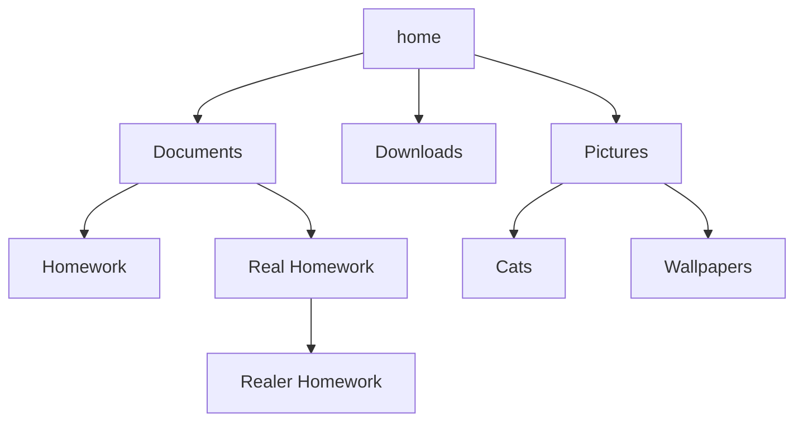
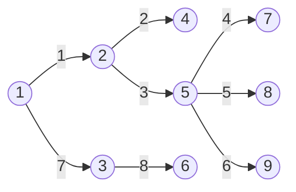

---
# try also 'default' to start simple
theme: seriph
# random image from a curated Unsplash collection by Anthony
# like them? see https://unsplash.com/collections/94734566/slidev
background: https://source.unsplash.com/collection/94734566/1920x1080
# apply any windi css classes to the current slide
class: 'text-center'
# https://sli.dev/custom/highlighters.html
highlighter: shiki
# show line numbers in code blocks
lineNumbers: false
# some information about the slides, markdown enabled
info: |
  ## Slidev Starter Template
  Presentation slides for developers.

  Learn more at [Sli.dev](https://sli.dev)
# persist drawings in exports and build
drawings:
  persist: false
---

# Last Minute Basics and Graph Theory

Presentation slides for developers

<div class="pt-12">
  <span @click="$slidev.nav.next" class="px-2 py-1 rounded cursor-pointer" hover="bg-white bg-opacity-10">
    Press Space for next page <carbon:arrow-right class="inline"/>
  </span>
</div>

<div class="abs-br m-6 flex gap-2">
  <button @click="$slidev.nav.openInEditor()" title="Open in Editor" class="text-xl icon-btn opacity-50 !border-none !hover:text-white">
    <carbon:edit />
  </button>
  <a href="https://github.com/slidevjs/slidev" target="_blank" alt="GitHub"
    class="text-xl icon-btn opacity-50 !border-none !hover:text-white">
    <carbon-logo-github />
  </a>
</div>

<!--
The last comment block of each slide will be treated as slide notes. It will be visible and editable in Presenter Mode along with the slide. [Read more in the docs](https://sli.dev/guide/syntax.html#notes)
-->

---

# Common data structures

<div grid="~ cols-2 gap-4">
<div>

### Dictionaries
  - Very fast lookups
  - Can use tuples (among other things) as keys

```python
# with lists
l_grid = []
for r in range(10):
    row = []
    for c in range(10):
        row.append(0)
    grid.append(row)

# with dict
d_grid = {}
for r in range(10):
    for c in range(10):
        grid[(r, c)] = 0
```

</div>
<div>

```python
# say you want to access/add a point outside of the grid
point = l_grid[12][20] # errors, annoying

# with dictionaries
point = d_grid.get((12, 20), None)
if point is None:
    d_grid[(12, 20)] = "Something here"


```

</div>
</div>

---

# Common data structures (cont)

<br><br>

<div grid="~ cols-2 gap-4">
<div>

### Sets
  - Much faster compared to lists
    - Use if you are storing a lot of data and don't care about order
  - Set functions (union, difference, intersection)

### Deque
  - when you want a list but are frequently adding removing items from the left/either side


</div>
<div>

```python
from collections import deque

d = deque("B")
d.append("C")
d.appendleft("A")

# deque(["A", "B", "C"])

d.rotate()

# deque(["C", "A", "B"])

d.popleft() # "C"
d.pop() # "B"
```

</div>
</div>


---

# Useful tips and tricks

<div grid="~ cols-2 gap-4">
<div>

  - You have access to the python docs during the contest
  - Modules such as collections, itertools
  - using sys.stdin for faster input

</div>
<div>

```python
import sys
input = sys.stdin.readline

n = int(input()) # 10000
for _ in range(n):
    x = input().strip()
    do_something(x)
```
</div>
</div>

---

# What is a graph?

<div grid="~ cols-2 gap-4">
<div>

### Examples of graphs

- Social media network
- Cities and roads
- Your folder system

</div>
<div>



</div>
</div>

---

# Depth first search

<div grid="~ cols-2 gap-4">
<div>

- Traverse the child of each node until we have exhausted all possible nodes
- Can be implemented recursively
- $O(n+m)$ time complexity, where $N$ is the number of nodes, $M$ is number of edges

<br><br>


</div>
<div>

```python
seen = set()
def dfs(node):
    if x in seen:
        return
    seen.add(node)
    # process node
    for child in graph[node]:
        dfs(child)
```

</div>
</div>
    
---

# Breadth first search

<div grid="~ cols-2 gap-4">
<div>

- Traverse the graph in "layers"
- Often implemented with a queue structure
- $O(n+m)$ time complexity, where $N$ is the number of nodes, $M$ is number of edges

<br><br>


</div>
<div>

```python
visited = set() # prevent searching a node twice
# distance is a dict that maps each node to its
# distance from starting node

distance = {}
# starting node is distance 0 from itself
distance[node] = 0 
# use deque for fast insertion/deletion from both ends
queue = deque()
queue.append(node)
visited.add(node)

while queue: # while queue is not empty
    next_node = queue.popleft()
    for child in graph[next_node]:
        if child in visited:
            continue
        visited.add(child)
        distance[child] = distance[next_node] + 1
        queue.append(child)

```
    
</div>
</div>

---


<div grid="~ cols-2 gap-4">
<div>

# Problem 1

- Basic flood-fill algorithm
- Create a "searched" mapping for all coordinates
- Start a bfs from every non-searched location

```python
import sys
from collections import deque
input = sys.stdin.readline

fl = int(input())
n, m = int(input()), int(input())
grid = []
tot_rooms = 0
seen = set()
for i in range(n):
    grid.append(input().strip())


def adj(r, c):
    for row, col in [(r+1, c), (r-1, c), 
        (r, c+1), (r, c-1)]:
        if 0<=row<n and 0<=col<m:
            yield (row, col)
```

</div>
<div>

```python
def flood_fill(r, c):
    queue = deque()
    queue.append((r, c))
    seen.add((r, c))
    room_size = 1

    while queue:
        row, col = queue.popleft()
        for coords in adj(row, col):
            if coords in seen or 
                grid[coords[0]][coords[1]] == "I":
                continue
            room_size += 1
            seen.add(coords)
            queue.append(coords)
    return room_size

```

</div>
</div>

---

# Solution (cont)

```python
rooms = []
for row in range(n):
    for col in range(m):
        if (row, col) in seen or grid[row][col] == "I": 
            continue
        rooms.append(flood_fill(row, col))

rooms.sort(reverse=True)
for room in rooms:
    if room > fl: break
    fl -= room
    tot_rooms += 1

if tot_rooms == 1:
    print(f"{tot_rooms} room, {fl} square metre(s) left over")
else:
    print(f"{tot_rooms} rooms, {fl} square metre(s) left over")
```
[pastebin link](https://pastebin.com/jhp3PULg)

---

<div grid="~ cols-2 gap-4">
<div>

# Problem 2

- Run a DFS to search every single possible path
- For each path, we know that every road **not** on the path is a disconnecting road
- run a set union for each path found, take length of final set

```python
import sys
import collections
input = sys.stdin.readline

roads = set()
graph = collections.defaultdict(list)

while True:
    r = input().strip()
    if r == "**": break
    roads.add(r)
    graph[r[0]].append(r[1])
    graph[r[1]].append(r[0])

```

</div>
<div>

```python
seen = set()
def dfs(path, node):
    global roads
    for ch in graph[node]:
        if ch == "B":
            npath = path + ch
            trace = set()
            for i in range(len(npath) - 1):
                road = npath[i:i+2]
                trace.add(road)
                trace.add(road[::-1])
            roads &= trace
            continue

        elif ch not in path:
            dfs(path+ch, ch)

dfs("A", "A")
if roads:
    print(*roads, sep="\n")
    
print(f"There are {len(roads)} disconnecting roads.")
```

[Pastebin](https://pastebin.com/CgcdKpcV)
</div>
</div>

